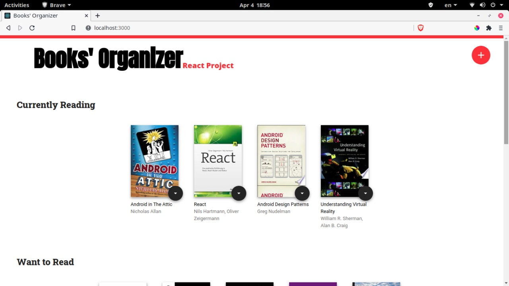
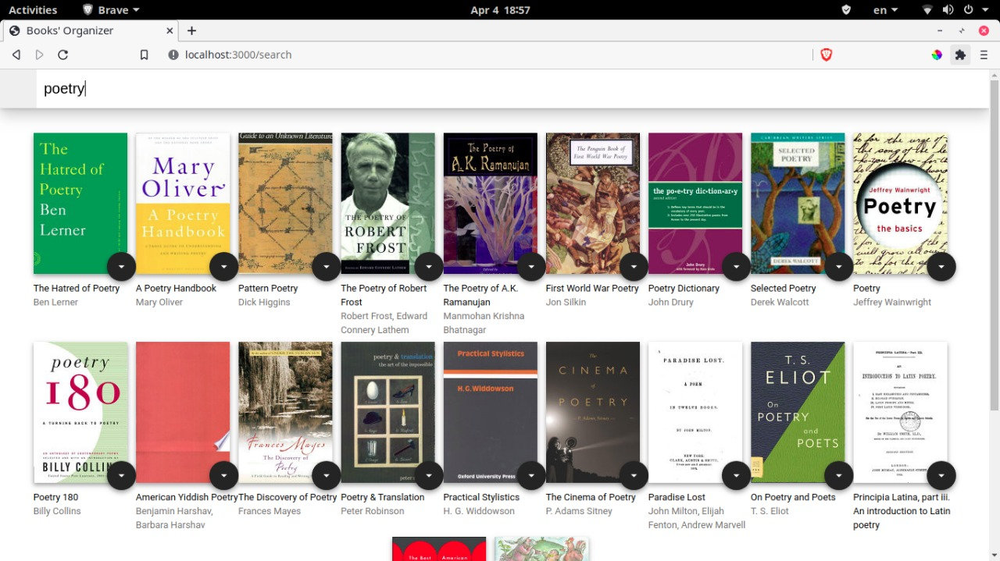

[](https://app.netlify.com/sites/books-organizer/deploys)

# MyReads Project

This is 2nd Project of FWD Egypt initiative with udacity ,using React




# Getting Started:

To get started developing right away:

- install all project dependencies with `npm install`
- start the development server with `npm start`

# Installation

Clone the repository, change directories, and use NPM to install the dependencies.

```bash
$ git clone https://github.com/sara-elhawary/react-books--organizer.git
$ cd react-books--organizer
$ npm install
```

# Usage

The project can be run with

- `npm start`

The project can be viewed in the browser at

- [http://localhost:3000](http://localhost:3000)
